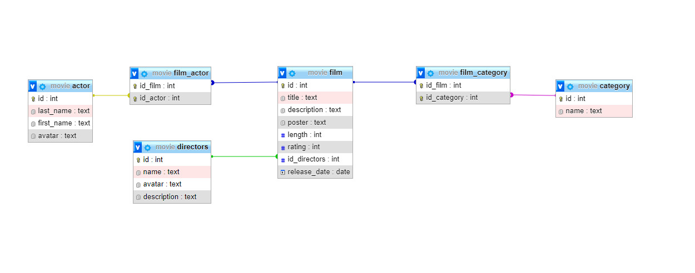

## Quản lý movie
***Tạo bảng actor***
```sql
CREATE TABLE `actor` (
  `id` int NOT NULL,
  `last_name` text NOT NULL,
  `first_name` text NOT NULL,
  `avatar` text
)
```

***Tạo bảng category***
```sql
CREATE TABLE `category` (
  `id` int NOT NULL,
  `name` text NOT NULL
)
```

***Tạo bảng directors***
```sql
CREATE TABLE `directors` (
  `id` int NOT NULL,
  `name` text NOT NULL,
  `avatar` text,
  `description` text NOT NULL
)
```

***Tạo bảng film***
```sql
CREATE TABLE `film` (
  `id` int NOT NULL,
  `title` text NOT NULL,
  `description` text NOT NULL,
  `poster` text NOT NULL,
  `length` int NOT NULL,
  `rating` int NOT NULL,
  `id_directors` int NOT NULL,
  `release_date` date DEFAULT NULL
)
```

***Tạo bảng film_actor***
```sql
CREATE TABLE `film_actor` (
  `id_film` int NOT NULL,
  `id_actor` int NOT NULL
)
```

***Tạo bảng film_category***
```sql
CREATE TABLE `film_category` (
  `id_film` int NOT NULL,
  `id_category` int NOT NULL
)
```


